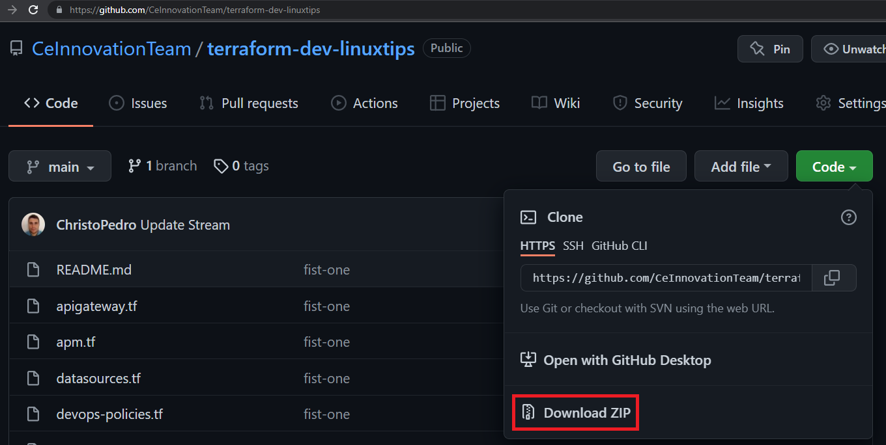
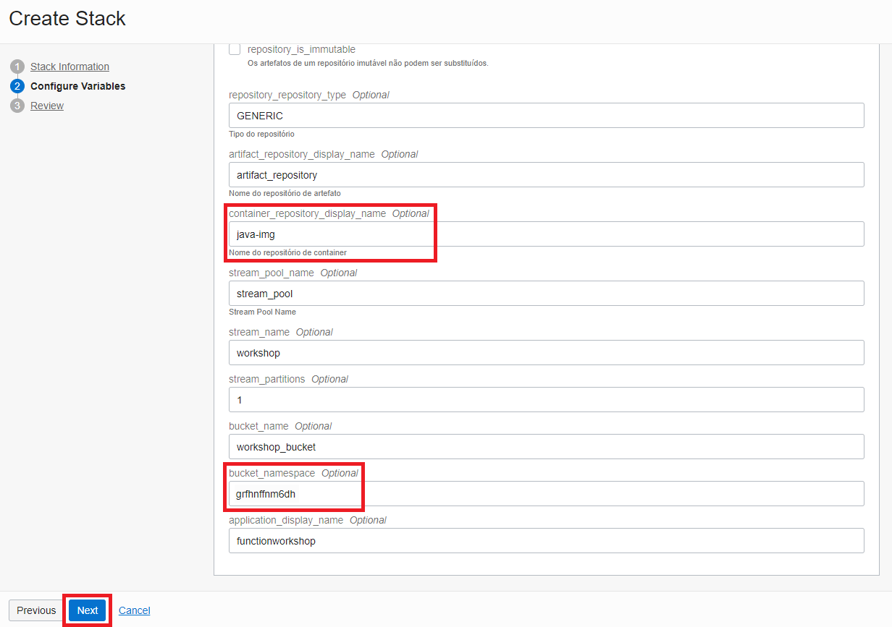
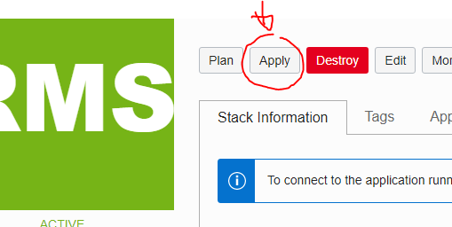

# Lab. 1 - Resource Provisioning  

Nesta etapa, você irá provisionar recursos dentro da OCI utilizando infraestrutura como código (IaC) com o Resource Manager!

- 🌀 [Página oficial do Resource Manager](https://www.oracle.com/br/devops/resource-manager/)
- 🧾 [Documentação do Resource Manager](https://docs.oracle.com/pt-br/iaas/Content/ResourceManager/home.htm)

**Os recursos provisionados ser√£o:**

- OKE
- OCI DevOps
- APM
- API Gateway
- Streaming
- Object Storage

**Juntamente com recursos de REDE e GERENCIAMENTO como:**

1. VCN

2. SUBNETS

3. DYNAMIC GROUPS

4. COMPARTMENTS

  

## 1. Download repositório

  

 - Como primeiro passo devemos fazer o download do arquivo no repositório do github.

 - Para isso, acesse o [repositório](https://github.com/CeInnovationTeam/terraform-dev-linuxtips) e clique em **Download ZIP**.
  

  

## Upload do terraform no Oracle Resource Manager

  

- Primeiro de tudo devemos estar **logados no OCI**

- Vá até o menu sanduiche na esquerda

  

- Clique em "**Developer Services**"

  

- Nas opcões que aparecer selecione "**Resource Manager**".

  

- Selecione e crie uma nova **STACK**

  

- Selecione como source **a pasta do seu computador contendo os arquivos .tf baixados**, fazendo assim com que o Resource Manager j√° preencha todos os campos.

  

- Clique em NEXT e podemos conferir as infos sobre os recursos que ser√£o provisionados.

- Lembre-se de selecionar o compartment criado, como abaixo.

- Ao final da p√°gina, altere o display name padr√£o do container registry de "container_repository" para "java-img".

- Lembre-se também de alterar o bucket_namespace para o namespace da sua tenancy, como abaixo.

- Criado nossa STACK vamos agora clicar em PLAN

  

  

- Após concluído nosso PLAN, vamos agora voltar para nossa STACK e clicar em APPLY para de fato iniciar os provisionamentos e isso irá durar em torno de uns 20 minutos.

  

  

  

## Ambientes Provisionados com Sucesso !

 - Após finalizar o APPLY com sucesso, podemos conferir nossos
   provisionamentos que foram efetuados!

### 😎 Booooaaa !!! Você foi capaz de provisionar recursos usando Terraform na OCI! 🚀

