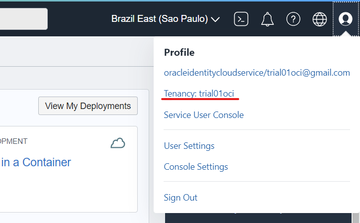

# Lab 2 - Developing Cloud Native Applications - Parte 1

Laboratório para mostrar na prática o funcionamento das ferramentas de developer no OCI.

## Objectivo

Criar uma aplicação no Kubernetes com as imgaens de container armazenadas no Oracle Container Registry (OCIR). O backend da aplicação será exposto através do API Gateway, onde receberá os headers de CORS necessários para se comunicar com o frontend.

Além disso a aplicação já contará com as bibliotecas e configurações necessárias para ser monitorada pelo APM que será demonstrado no laboratório 5.

- [Lab 2 - Developing Cloud Native Applications - Parte 1](#lab-2---developing-cloud-native-applications---parte-1)
  - [Objectivo](#objectivo)
  - [Coleta de Informações](#coleta-de-informações)
    - [Tenancy Namespace](#tenancy-namespace)
    - [User OCID & Auth Token](#user-ocid--auth-token)
    - [Dados do APM](#dados-do-apm)
    - [Código da Região](#código-da-região)
  - [Docker Login](#docker-login)
  - [Configurar o Kubectl](#configurar-o-kubectl)
  - [Copiar o Código](#copiar-o-código)

## Coleta de Informações

Vamos coletar algumas informações na tenancy do OCI que serão utilizadas ao logo do laboratório, recomendamos que as anote em um bloco de nota para ter sempre em mãos de modo fácil. Serão coletadas as seguintes informações:

```bash
Tenancy Namespace:
User OCID:
Auth Token:
APM Endpoint:
Public Key:
Código da Região:
```

### Tenancy Namespace

Clique no menu do lado direto no icone do usuário, clique no nome da sua tenency.



Agora copie o namespace para o bloco de notas.


### User OCID & Auth Token

Clique no menu do lado direto no icone do usuário, clique no nome do seu usuário.


Copie o OCID do usuário e salve no bloco de notas.

Depois, vá em Auth Tokens e gere um novo token, salve o token no bloco de notas.


### Dados do APM

Navegue no menu principal em Observability & Management > Application Monitoring> Administration

Clique no domínio criado pelo Resource Manager no laboratório anterior, e copie os dados do Endpoint e da Public Key.


### Código da Região

Você pode pesquiar o código da sua região [aqui](https://docs.oracle.com/en-us/iaas/Content/Registry/Concepts/registryprerequisites.htm#regional-availability)

## Docker Login

Vamos precisar do Docker para fazer o build dos containers da aplicação e fazer o push para o OCIR. Antes do push, precisamos nos logar no OCIR através do dorcker-CLI.

Abra o **Cloud Shell** e execute o comando abaixo substituindo o username, tenanacy ocid e código da região. E na senha utilize o Auth Token gerado anteriormente.

```bash
docker login <Codigo Region>.ocir.io -u <tenancy-namespace>/<username>
```

Resultado:

```bash
password: <Auth Token>
WARNING! Your password will be stored unencrypted in /home/trial01oci/.docker/config.json.
Configure a credential helper to remove this warning. See
https://docs.docker.com/engine/reference/commandline/login/#credentials-store
```

## Configurar o Kubectl

Agora vamos configurar o acesso ao Kubernetes via Kubectl no Cloud Shell, no menu principal vá em **Developer Services > Containers & Artifacts > Kubernetes Clusters (OKE)**.

Entre no cluster criado via Resource manager e clique no botão **Access Cluster**


Copie o comando que aparece no popup e execute no cloud shell.

Exemplo:

```bash
$ oci ce cluster create-kubeconfig --cluster-id ocid1.cluster.oc1.sa-saopaulo-1.aaaaaaaan2pf --file $HOME/.kube/config --region sa-saopaulo-1 --token-version 2.0.0  --kube-endpoint PUBLIC_ENDPOINT

New config written to the Kubeconfig file /home/trial01oci/.kube/config

```

## Copiar o Código

Abra o Cloud Shell e execute o git clone do código da aplicação:

``` git clone ```