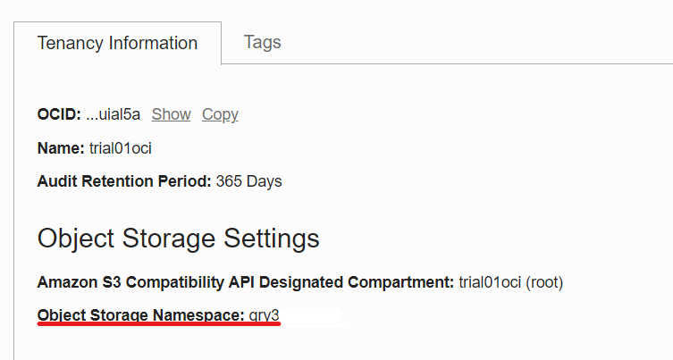

# Lab 2 - Developing Cloud Native Applications - Parte 1

Laboratório para mostrar na prática o funcionamento das ferramentas de developer no OCI.

## Objectivo

Criar uma aplicação no Kubernetes com as imagens de container armazenadas no Oracle Container Registry (OCIR). O backend da aplicação será exposto através do API Gateway, onde receberá os headers de CORS necessários para se comunicar com o frontend.

Além disso a aplicação já contará com as bibliotecas e configurações necessárias para ser monitorada pelo APM que será demonstrado no laboratório 5.

- [Lab 2 - Developing Cloud Native Applications - Parte 1](#lab-2---developing-cloud-native-applications---parte-1)
  - [Objectivo](#objectivo)
  - [Coleta de Informações](#coleta-de-informações)
    - [Tenancy Namespace](#tenancy-namespace)
    - [User OCID & Auth Token](#user-ocid--auth-token)
    - [Dados do APM](#dados-do-apm)
    - [Código da Região](#código-da-região)
  - [Docker Login](#docker-login)
  - [Configurar o Kubectl](#configurar-o-kubectl)
  - [Copiar o Código](#copiar-o-código)
  - [Configurar e fazer o Deploy do Backend](#configurar-e-fazer-o-deploy-do-backend)
    - [Docker Build](#docker-build)
    - [Docker Push](#docker-push)
    - [Criando Secret no Kubernetes](#criando-secret-no-kubernetes)
    - [Configurar o Manifesto de Kubernetes](#configurar-o-manifesto-de-kubernetes)
    - [Deploy no Kubernetes](#deploy-no-kubernetes)
  - [Configuração API Gateway](#configuração-api-gateway)

## Coleta de Informações

Vamos coletar algumas informações na tenancy do OCI que serão utilizadas ao logo do laboratório, recomendamos que as anote em um bloco de nota para ter sempre em mãos de modo fácil. Serão coletadas as seguintes informações:

```bash
Tenancy Namespace:
User OCID:
Auth Token:
APM Endpoint:
Public Key:
Código da Região:
```

### Tenancy Namespace

Clique no menu do lado direto no icone do usuário, clique no nome da sua tenency.


Agora copie o namespace para o bloco de notas.



### User OCID & Auth Token

Clique no menu do lado direto no icone do usuário, clique no nome do seu usuário.


Copie o OCID do usuário e salve no bloco de notas.

Depois, vá em Auth Tokens e gere um novo token, salve o token no bloco de notas.


### Dados do APM

Navegue no menu principal em Observability & Management > Application Monitoring> Administration

Clique no domínio criado pelo Resource Manager no laboratório anterior, e copie os dados do Endpoint e da Public Key.


### Código da Região

Você pode pesquiar o código da sua região [aqui](https://docs.oracle.com/en-us/iaas/Content/Registry/Concepts/registryprerequisites.htm#regional-availability)

## Docker Login

Vamos precisar do Docker para fazer o build dos containers da aplicação e fazer o push para o OCIR. Antes do push, precisamos nos logar no OCIR através do dorcker-CLI.

Abra o **Cloud Shell** e execute o comando abaixo substituindo o username, tenanacy ocid e código da região. E na senha utilize o Auth Token gerado anteriormente.

```bash
docker login <Codigo Region>.ocir.io -u <tenancy-namespace>/<username>
```

Resultado:

```bash
password: <Auth Token>
WARNING! Your password will be stored unencrypted in /home/trial01oci/.docker/config.json.
Configure a credential helper to remove this warning. See
https://docs.docker.com/engine/reference/commandline/login/#credentials-store
```

## Configurar o Kubectl

Agora vamos configurar o acesso ao Kubernetes via Kubectl no Cloud Shell, no menu principal vá em **Developer Services > Containers & Artifacts > Kubernetes Clusters (OKE)**.

Entre no cluster criado via Resource manager e clique no botão **Access Cluster**


Copie o comando que aparece no popup e execute no cloud shell.

Exemplo:

```bash
$ oci ce cluster create-kubeconfig --cluster-id ocid1.cluster.oc1.sa-saopaulo-1.aaaaaaaan2pf --file $HOME/.kube/config --region sa-saopaulo-1 --token-version 2.0.0  --kube-endpoint PUBLIC_ENDPOINT

New config written to the Kubeconfig file /home/trial01oci/.kube/config

```

O acesso pode ser testado com o seguinte comando:

```bash
kubectl get nodes
```

Deve ter uma resposta parecida com essa:

```bash
NAME           STATUS   ROLES   AGE     VERSION
10.20.10.125   Ready    node    3h23m   v1.21.5
10.20.10.138   Ready    node    3h23m   v1.21.5
10.20.10.208   Ready    node    3h23m   v1.21.5
```

## Copiar o Código

Abra o Cloud Shell e execute o git clone do código da aplicação:

```bash
git clone https://github.com/ChristoPedro/labcodeappdev.git 
```

## Configurar e fazer o Deploy do Backend

Navegue até a pasta do backend:

```bash
cd labcodeappdev/Backend/code
```

Vamos realizar o build da imagem do backend e depois fazer o push para o OCIR.

### Docker Build

Execute o comando:

```bash
docker build -t <Codigo Region>.ocir.io/<tenancy-namespace>/linuxtips/back .
```

### Docker Push

Depois da Build vamos fazer o push para o OCIR

```bash
docker push <Codigo Region>.ocir.io/<tenancy-namespace>/linuxtips/back
```

### Criando Secret no Kubernetes

Vamos criar um secret que irá conter as informações do login do OCIR. Permitindo assim que seja feito o pulling das images.

Basta executar esse código, substituindo os valores

```bash
kubectl create secret docker-registry ocisecret --docker-server=<region-key>.ocir.io --docker-username='<tenancy-namespace>/<oci-username>' --docker-password='<oci-auth-token>' --docker-email='<email-address>'
````
Resposta:

```bash
secret/ocisecret created
```

### Configurar o Manifesto de Kubernetes

Vamos agora voltar uma pasta:

```bash
cd ..
```

Editar o código para adicionar os parametros do APM e da imagem:

```bash
vi Deploybackend.yaml
```

Pressione **i** para editar.

Substitua os valores de Codigo de Região, Namespace, Endpoint do APM e Key do APM nas seguites linhas:

```bash
      - name: backend
        image: [Sua Região/Namespace]/linuxtips/back:latest
        imagePullPolicy: Always
        ports:
        - containerPort: 5000
        env:
        - name: APM_URL
          value: "[Substitua pelo Endpoint do APM]"
        - name: APM_KEY
          value: "[Substitua pela Public Key do APM]"
```

Após substituir os valores utilize os seguintes comando **ESC : WQ** e pressione Enter.

### Deploy no Kubernetes

Com o arquivo editado podemos executar o seguinte comando para realizar o deploy:

```bash
kubectl apply -f Deploybackend.yaml
```

Deve ter uma saida como a seguinte:

```bash
deployment.apps/cepapp-backend created
service/cepapp-backend created
```

Podemos usar o seguinte código para saber se os pods já estão no ar:

```bash
kubectl get pods
```

## Configuração API Gateway

Primeiro precisamos descobrir o IP do loadbalancer do serviço do backend.

```bash
kubectl get svc cepapp-backend
```

A resposta será parecida com essa:

```bash
NAME             TYPE           CLUSTER-IP      EXTERNAL-IP    PORT(S)          AGE
cepapp-backend   LoadBalancer   10.96.123.143   10.20.20.237   5000:31952/TCP   13m
```

Vamos utilizar o EXTERNAL-IP para realizar expor-lo através do API Gateway.

