## Configurando serviço de Logging

Nesse laboratório criaremos nosso Log Group onde armazenaremos os logs dos serviços de Object Storage, Events, e Functions. Essa ação fará com que fique muito mais fácil a identificação de possíveis falhas na estrutura que desenvolvemos.
Para essa tarefa utilizaremos os seguintes recursos:
 
 - **Oracle Logging:** [https://docs.oracle.com/pt-br/iaas/Content/Logging/Concepts/loggingoverview.htm](https://docs.oracle.com/pt-br/iaas/Content/Logging/Concepts/loggingoverview.htm)

#### Criando Log Group
1. No menu no canto esquerdo superior, em **Observability & Management**, selecione **Grupos de Log** (Log Groups)

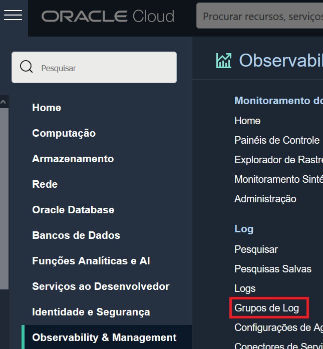

2. No canto esquerdo inferior verifique se o **compartimento** que você esta utilizando para esse laboratório esta selecionado.

3. Clique em **Criar Grupo de Logs** (Create Log Group).
4. No formulário de novo Grupo de Log preencha as seguintes informações:
- Nome (Name): < Defina um nome para o Log Group >
- Descrição (Description): < Defina uma descrição para o Log Group >

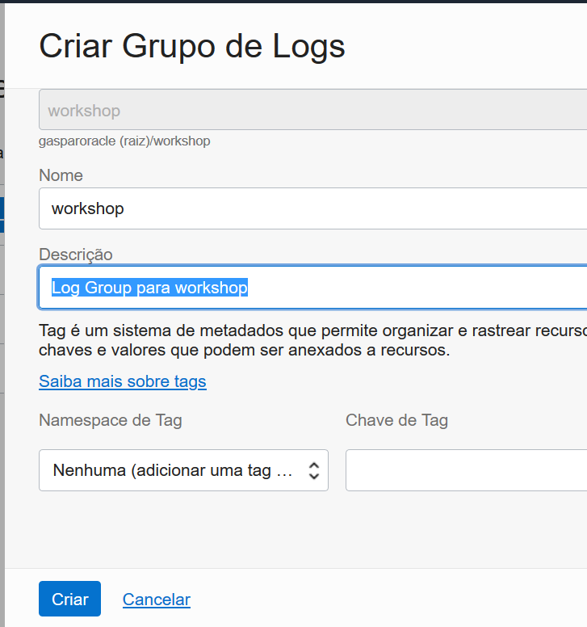

5. Clique em **Criar** (Create).
#### Habilitando log de Object Storage
1. No menu no canto esquerdo superior, em **Armazenamento** (Storage), acesse **Buckets**
2. No canto esquerdo inferior verifique se o **compartimento** que você esta utilizando para esse laboratório esta selecionado.
3. Selecione o bucket **"workshop_bucket"**.
4. No canto esquerdo inferior da tela, na sessão de **Recursos**(Resources) selecione **Logs**.

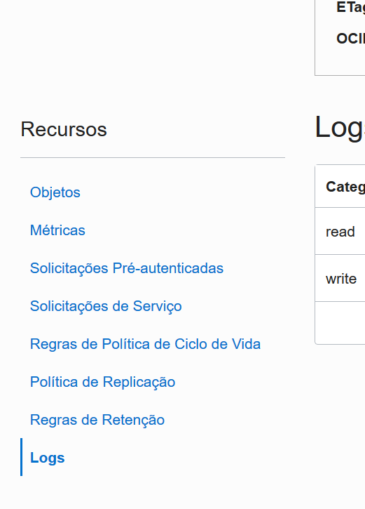

5. Na linha de **read** habilite o log clicando no toggle de ativação destacado na imagem abaixo:

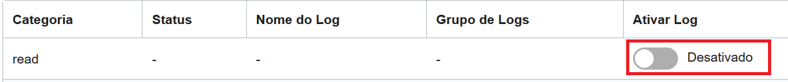

6. No formulário de ativação do Log certifique-se de que o **Grupo de Log escolhido é o mesmo que foi criado previamente nesse laboratório.**

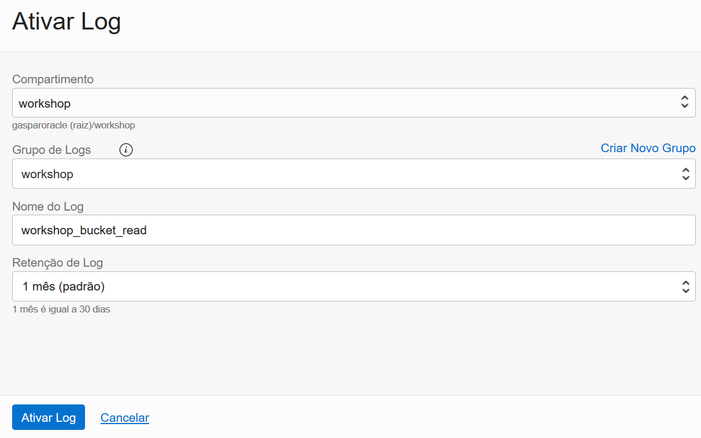

7. Clique em **Ativar Log**
8. Repita o processo para a linha de **write**. Ao final voce deve ter algo similar a imagem abaixo:

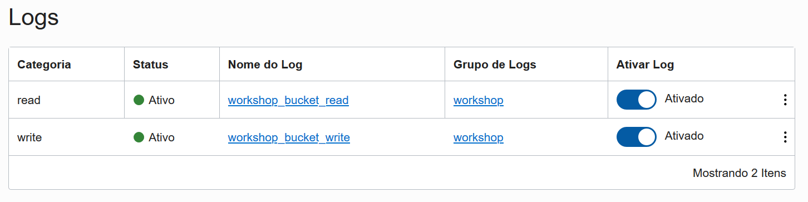

#### Habilitando log de Evento
9. Acesse o menu no canto superior esquerdo, em **Observability & Management**, clique em **Serviço Events** (Events Service).
10. No canto esquerdo inferior verifique se o **compartimento** que você esta utilizando para esse laboratório esta selecionado.
11. Acesse a **regra de evento criada no laboratório anterior.** 

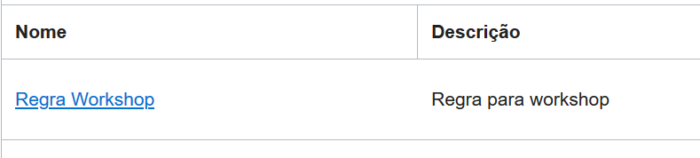

12. No canto esquerdo inferior da tela, na sessão de **Recursos**(Resources) selecione **Logs**.

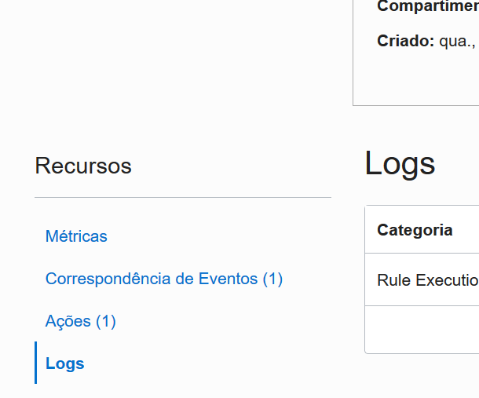

13. Repita o processo de ativação de log, para a linha **Rule Execution Logs**, certificando-se de que o Log Group criado nesse laboratório esta selecionado.

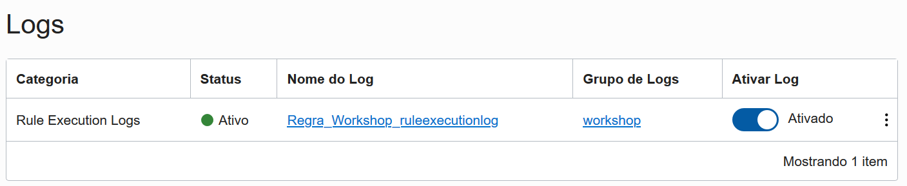

#### Habilitando log de Função
14. Abra o menu no canto superior esquerdo, em **Serviços de Desenvolvimento** (Developer Services), selecione **Functions**
15. No canto esquerdo inferior verifique se o **compartimento** que você esta utilizando para esse laboratório esta selecionado.
16. Selecione a **função criada anteriormente no LAB02 deste guide.**

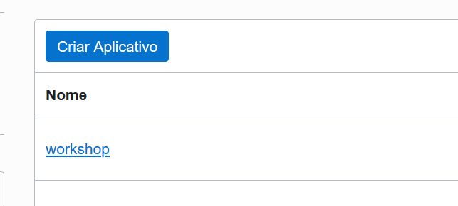

17. No canto esquerdo inferior da tela, na sessão de **Recursos**(Resources) selecione **Logs**.

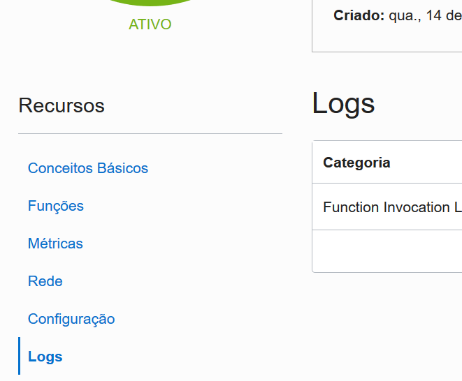

18. Repita o processo de ativação de log, para a linha **Function Invocation Logs**, certificando-se de que o Log Group criado nesse laboratório esta selecionado.

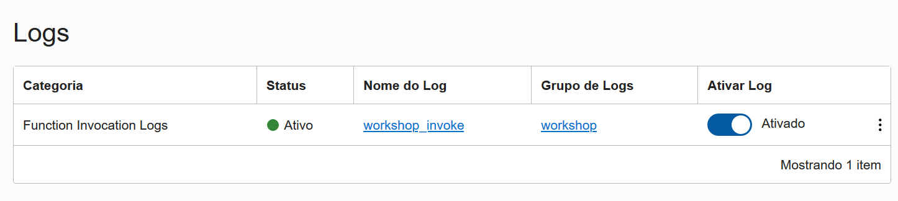

#### Acessando os logs gerados pelas plataformas
19. Retorne à pagina de Log Groups, acessando o menu no canto esquerdo superior, em **Observability & Management**, selecione **Grupos de Log** (Log Groups)
20. Selecione o **Log Group anteriormente criado  nesse laboratório**.

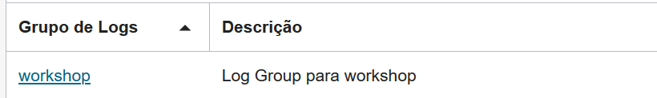

21. Verifique se todos os logs habilitados nesse lab estão sendo direcionados para este log group clicando na sessão de **Recursos**(Resources) em **Logs**.

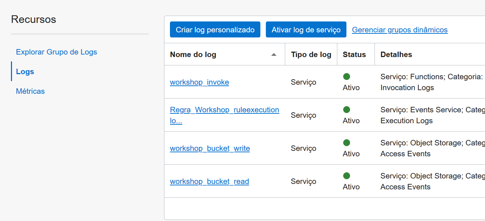

### Refaça os testes do LAB03 e retorne a tela do seu Log Group para verificar os Logs gerados pelo fluxo que você desenvolveu

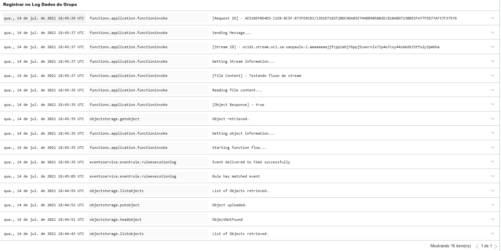

## Obrigado por acompanhar o workshop!

[<--------RETORNAR](../README.md)