# Lab. #4 - Automating Deployment

Nesta etapa construirá uma esteira de desenvolvimento capaz de entregar uma aplicação containerizada, de forma automatizada, a um cluster Kubernetes!

**Você aprenderá todo o passo-a-passo dessa implementação:**
 - [Pre Reqs: Executar terraform de preparação de ambiente, e coletar informações relevantes ao processo](#PreReqs)
 - [Passo 1: Clonar o repositório e movimentar conteúdo para repositório do projeto DevOps](#Passo1)
 - [Passo 2: Criar e configurar processo de Build (CI)](#Passo2)
 - [Passo 3: Criar e configurar entrega de artefatos (CI)](#Passo3)
 - [Passo 4: Criar e configurar entrega de aplicação a cluster kubernetes (CD)](#Passo4)
 - [Passo 5: Configurar gatilho do fluxo e conectar pipelines de CI/CD](#Passo5)
 - [Passo 6: Execução e testes](#Passo6)


 ## <a name="PreReqs"></a> Pre Reqs: Executar terraform de preparação de ambiente, e coletar informações relevantes ao processo

 1. Faça login em sua conta na Cloud. [link](https://www.oracle.com/cloud/sign-in.html) 
 2. Execute o [Laboratório 2](../2%20-%20Using%20Terraform%20on%20OCI) deste workshop - *Execute apenas se você não o executou anteriormente*
 3. No canto direito superior, clique no icone de perfil, e clique em seu usuário

 

 4.  No canto esquerdo inferior, clique em **Auth Tokens**, em seguida clique em **Gerar Token**

 

 5. Dê uma descrição ao token, e clique em **Gerar Token**

 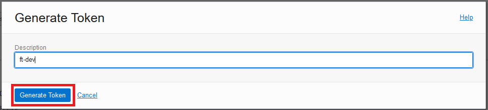

 6. **ATENÇÃO** - Copie o código gerado para um **bloco de notas**, se caso você perder esse código será necessario gera-lo novamente

 
 


 - Durante todo este laboratório, utilizaremos este código quando for solicitada a informação de **Auth Token**


 7. No menu, no canto esquerdo superior acesse: Observabilidade & Gerenciamento > Application Performance > Administração

 
 


 8.  No canto esquerdo inferior, em Escopo, valide se o compartimento correto está selecionado:

  
 


 9. Selecione o Dominio listado: 
   
 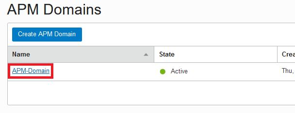

 10. Copie as informações necessárias para o bloco de notas:

    - APM_ENDPOINT: Item 1 da imagem
    - APM_PVDATAKEY: Item 2 da imagem


 11. Retorne a página de dominios

 
 
 12. No canto esquerdo inferior, em Recursos clique em **Download APM Agent**

 
 
 13. **Com o botão direito do mouse** clique no item listado, e selecione **Copiar Link**

 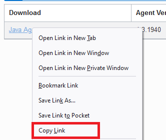

 - APM_AGENT_URL: Cole o link copiado no bloco de notas 

Com isso cumprimos todos os pré requisitos para o laboratório:

 
 

 ## <a name="Passo1"></a> Passo 1: Clonar o repositório e movimentar conteúdo para repositório do projeto DevOps

 1. Acesse o recurso de cloud shell
 
 


 2. Clone o repositório do projeto 

 ```shell
 git clone https://github.com/CeInnovationTeam/BackendFTDev.git
 ```

 3. Acesse: Menu > Serviços de Desenvolvedor > Devops > Projetos
  
 

 4. Acesse o projeto listado
  
 

 5. Na página do projeto, clique em **Criar repositório**  

 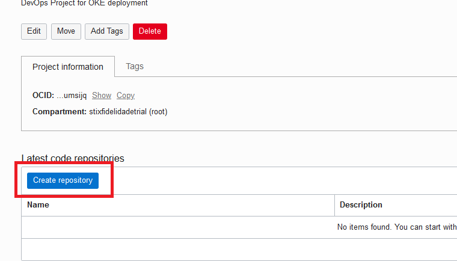

 6. Preencha o formulário da seguinte forma:

   - Nome: ftRepo
   - Description: (Defina uma descrição qualquer)
   - Branch Default: main

 

 7. Na pagina do repositório recém criado, clique em HTTP e:

    - Copie para o bloco de notas a informação do usuário a ser usado para trabalhar com o git (Referênciaremos esta informação como **Usuário Git**)
    - Execute o comando de git clone no CloudShell

 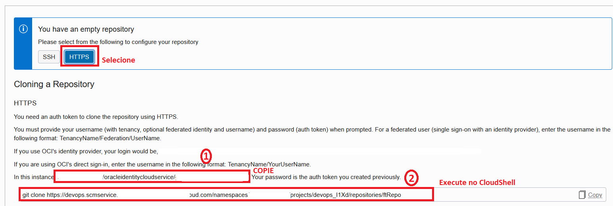

 8. No CloudShell, ao executar o comando, informe o **Usuario Git** recém copiado, e o seu **Auth Token** como senha

 9. Neste momento o CloudShell deve possuir dois novos diretórios:
 - BackendFTDev
 - ftRepo
 
 

 10. Execute os seguintes comandos para copiar o conteúdo do repositório BackendFTDev, para o repositório ftRepo

 ```shell
 git config --global user.email "<seu-email>"
 git config --global user.name "<seu-username>"
 cp -r BackendFTDev/* ftRepo/
 cd ftRepo
 git add -A
 git commit -m "inicio do projeto"
 git push origin main
 ```

*Ao final do último comando o **Usuário git** e a senha (**Auth Token**) poderão ser solicitados novamente*

 ## <a name="Passo2"></a> Passo 2: Criar e configurar processo de Build (CI)

 1. Retorne a pagina inicial do projeto DevOps
 2. Clique em **Criar pipeline de Build** 

 

 3. Preencha o formulário da seguinte forma, e clique em Criar:
   - Nome: build
   - Descrição: (Defina uma descrição qualquer)

 

 4. Abra o pipeline de build recém criado.
 5. Na aba parametros, defina os seguintes parametros:
  - APM_ENDPOINT: Informação coletada nos pré requisitos
  - APM_PVDATAKEY: Informação coletada nos pré requisitos
  - APM_AGENT_URL: Informação coletada nos pré requisitos.
  *Clique no sinal de "+" para que a informação fique salva*
  
 

 6. Acesse a aba de **Build Pipeline**, e clique em **Add Stage**  

 

 7. Selecione a opção **Managed Build** e clique **Próximo**

 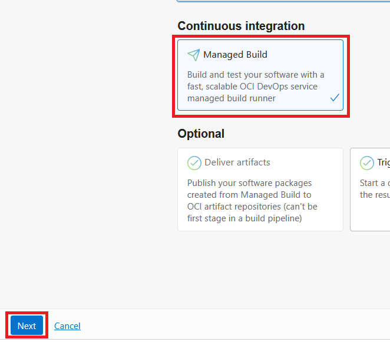

 8. Preencha o formulário da seguinte forma:

  - Stage Name: Criacao de artefatos
  - Descrição: (Defina uma descrição qualquer)
  - OCI build agent compute shape: (Não alterar)
  - Base container image: (Não alterar)
  - Build spec file path: (Não alterar)
      
    


  - Primary code repository: 
    - Clique no botão **Selecionar** a direita
    - Source Connection type: OCI Code Repository
    - Selecione o repositório **ftRepo**
    - Select Branch: (Não alterar)
    - Build source name: **java_root**
    - Clique em **Save**
    
    


  - Clique em **Criar**

 9. Neste momento é importante entender a forma como a ferramenta trabalha: 
    
- A ferramenta utiliza um documento no formato YAML para definir os passos que devem ser executados durante o processo de construção da aplicação.
- Por padrão este documento é chamado de build_spec.yaml e deve ser configurado previamente de acordo com as necessidades da aplicação
- Os passos serão então executados por uma instância temporária, que será provisionada no inicio de cada execução e destruida ao final do processo.
- Documentação de como formatar o documento de build: https://docs.oracle.com/pt-br/iaas/Content/devops/using/build_specs.htm
- Documento utilizado neste workshop: https://raw.githubusercontent.com/CeInnovationTeam/BackendFTDev/main/build_spec.yaml

 ## <a name="Passo3"></a> Passo 3: Criar e configurar entrega de artefatos (CI)

 1. Na aba de Build Pipeline, clique no sinal de **"+"** abaixo do stage **Criacao de artefatos** e em **Add Stage**
     
    


 2. Clique em **Deliver Artifacts** e em **Próximo**
     
    


 3. Preencha o formulário da seguinte forma:
 - Stage name: Entrega de artefato
 - Descrição: (Defina uma descrição qualquer)
 - Selecione **Criar Artefato**
   - Nome: backend_jar
   - Tipo: General Artifact
   - Artifact registry: Selecione o Registro de Artefato gerado pelo terraform de nome "artifact_repository"
   - Artifact location: Set a Custom artifact location and version
   - Artifact path: backend.jar
   - Version: ${BUILDRUN_HASH}
   - Replace parameters used in this artifact: Yes, substitute placeholders
   - Clique em adicionar
       
    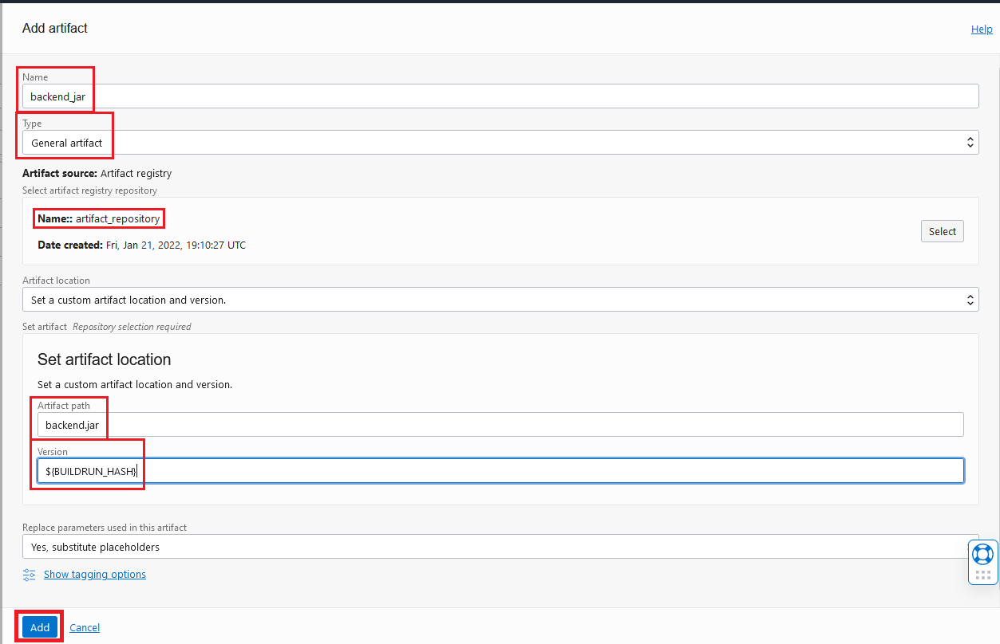


- Preencha o campo restante da tabela **Build config/result artifact name** com: app
    
    


 4. Clique em **Adicionar**
 5. Na aba de Build Pipeline, clique no sinal de **"+"** abaixo do stage **Entrega de artefato** e em **Add Stage**
 6. Clique em **Deliver Artifacts** e em **Próximo**
     
    

 7. Preencha o formulário da seguinte forma:
 - Stage name: Entrega de Image de Container
 - Descrição: (Defina uma descrição qualquer)
 - Selecione **Criar Artefato**
   - Nome: backend_Images
   - Tipo: Container image repository
   - Artifact Source: `<código-de-região>.ocir.io/${Images_PATH}`
   
   *para o código de referencia de sua região **composto por 3 letras**, utilize a [tabela de referencia](https://docs.oracle.com/en-us/iaas/Content/General/Concepts/regions.htm)*
       
    


 - Preencha o campo restante da tabela **Build config/result artifact name** com: docker-Images
       
    

8. Clique em **Adicionar**
9. Duplique a aba do seu navegador e acesse o OCIR.
10. No novo compartment criado, clique em **Create Repository**.


11. Em _Repository name_, insira o nome "java-Images" e clique em **Create Repository**.
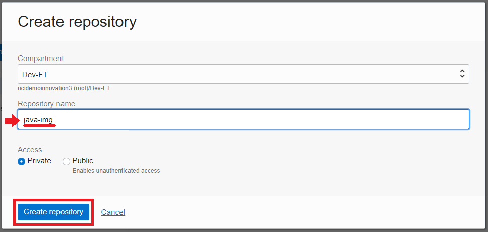
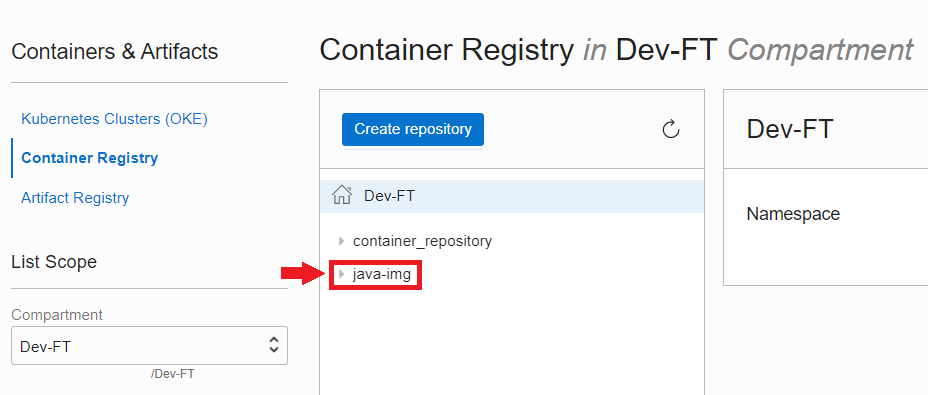


12. Volte à aba referente ao OCI DevOps e, no canto superior direito, clique em **Start Manual Run**
       
    

Isso conclui o passo de Build do projeto, onde automatizamos a compilação do código java, criamos a imagem de container, e armazenamos ambas nos repositórios de artefato, e de container respectivamente

## <a name="Passo4"></a> Passo 4: Criar e configurar entrega de aplicação a cluster Kubernetes (CD)

 1. Acesse: Menu > Serviços de Desenvolvedor > Kubernetes Clusters
        
    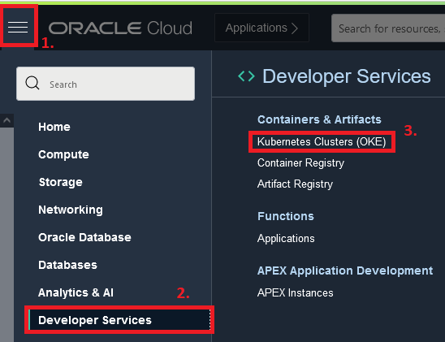

 2. Selecione o cluster listado
        
    

 3. Clique em **Access Cluster**
        
    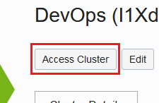

 4. Execute os passos 1 e 2 do guia
        
    

 5. Teste sua conexão com o cluster executando:

  ```shell
  kubectl get nodes
 ```

 6. Execute os comandos abaixo:

 ```shell
  cd ftRepo/scripts/
  chmod +x create-secret.sh 
  ./create-secret.sh  
 ```

 7. Informe o seu User OCID (https://docs.oracle.com/pt-br/iaas/Content/API/Concepts/apisigningkey.htm#five)
 8. No campo de password, informe o **Auth Token**
 9. Aguarde o final do fluxo
        
    

 10. Retorne ao projeto: Menu > Serviços de Desenvolvedor > DevOps > Projetos,  e selecione o projeto deste workshop
 11. No canto esquerdo, selecione **Environments**
         
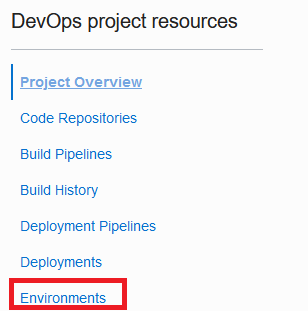

 12. Clique em **Create New Environment**
          


 13. Preencha o formulário da seguinte forma:
  - Environment type: Oracle Kubernetes Engine
  - Name: OKE
  - Description: OKE
 14. Clique em **Next**
 15. Selecione o Cluster de Kubernetes, e clique em **Create Envrinoment**
 16. No canto esquerdo selecione **Artifacts** em seguida em **Add Artifact**
          


 17. Preencha o formulario da seguinte forma:
 - Nome: deployment.yaml
 - Tipo: Kubernetes manifest
 - Artifact Source: Inline
 - Value: Cole o conteudo do arquivo https://github.com/CeInnovationTeam/BackendFTDev/blob/main/scripts/deployment.yaml
 *Não altere a identação (espaços) do documento, pois isso pode quebra-lo*
 - Replace parameters used in this artifact: Yes, substitute placeholders
 - Clique em **Add**
          
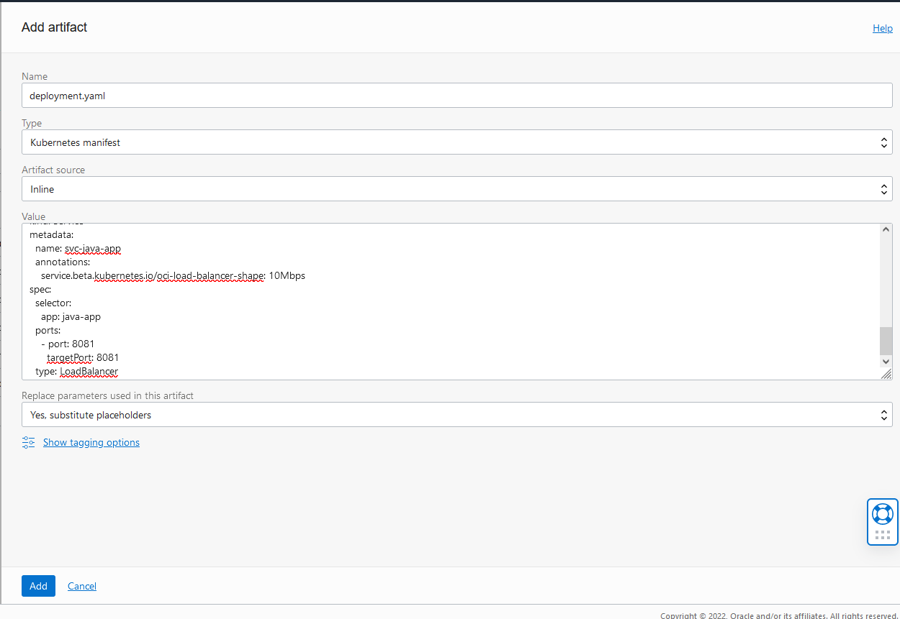

 18. No canto esquerdo, selecione **Developer Pipelines** em seguida clique em **Create Pipeline**
          


 19. Preencha o formulario da seguinte forma:
 - Pipeline name: deploy
 - Descrição: (Defina uma descrição qualquer)
 - Clique em **Create**
          


 20. Na Aba de **Parameters** configure o seguinte parametro:
 - REGISTRY_REGION:  <código-de-região>.ocir.io  
 *para o código de referencia de sua região **composto por 3 letras**, utilize a [tabela de referencia](https://docs.oracle.com/en-us/iaas/Content/General/Concepts/regions.htm)*
          


 21. Retorne a aba de **Pipeline** e clique em **Add Stage**
          


 22. Selecione a Opção **Apply Manifest to your Kubernetes Cluster** e clique em **Next**
          


 23. Preencha o formulário da seguinte forma:
 - Nome: **Deployment da Aplicacao**
 - Descrição: (Defina uma Descrição qualquer)
 - Environment: OKE
 - Clique em **Select Artifact** e selecione **deployment.yaml**
 - Clique em **Add**
          
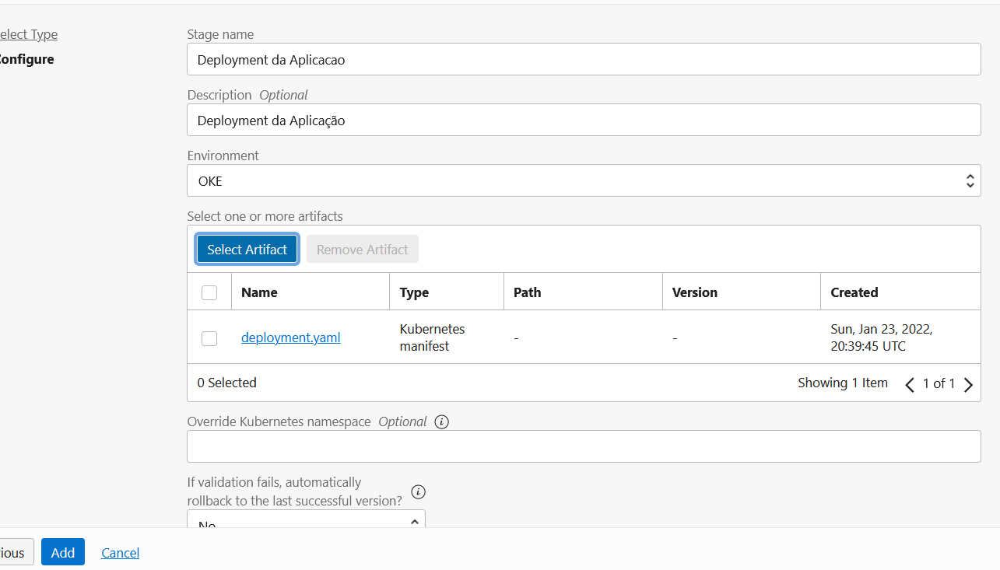

 
 Com isso finalizamos a parte de deployment, no passo a seguir vamos conectar ambos os pipelines, e definir um gatilho para que o processo automatizado se inicie

 ## <a name="Passo5"></a> Passo 5: Configurar gatilho do fluxo e conectar pipelines de CI/CD

  1. Retorne ao projeto: Menu > Serviços de Desenvolvedor > DevOps > Projetos,  e selecione o projeto deste workshop
  2. No canto esquerdo selecione **Triggers** e em seguida **Create Trigger**
  
  3. Preencha da seguinte forma:
  - Nome: Inicio
  - Descrição: (Defina uma descrição qualquer)
  - Source connection: OCI Code Repository
  - Select code repository: ftRepo
  - Actions: Add Action
    - Pipeline: build
    - Event: Push
    - Source branch: main
    - Clique em **Save**
  - Clique em **Create**
  

  A partir desse momento, qualquer novo push feito no repositorio do projeto iniciará o pipeline de build criado nesse workshop

  4. Retorne a configuração do pipeline de build do projeto selecionando **Build Pipelines**, **build**

  

  5. Na aba de Build Pipeline, clique no sinal de **"+"** abaixo do stage **Entrega de Imagem de Container** e em **Add Stage**

  

  6. Selecione o item de **Trigger Deployment**, e clique em **Next**

  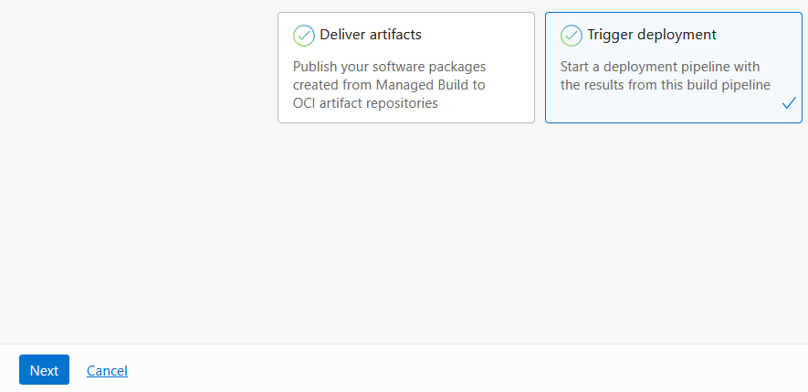

  7. Preencha o formulário da seguinte forma:
  - Nome: Inicio de Deployment
  - Descrição: (Defina uma descrição qualquer)
  - Selecione o pipeline de deployment: deploy
  - Mantenha os demais campos sem alteração, e clique em **Add**

  

  Parabéns!! Voce construiu com sucesso seu primeiro pipeline de DevOps dentro de Oracle Cloud!! O passo a seguir é direcionado para validação do projeto

 ## <a name="Passo6"></a> Passo 6: Execução e testes
 Neste passo validaremos a execução do projeto
  1.  Retorne ao projeto: Menu > Serviços de Desenvolvedor > DevOps > Projetos,  e selecione o projeto deste workshop
  2.  Retorne a configuração do pipeline de build do projeto selecionando **Build Pipelines**, **build**
  
  

  3. No canto esquerdo superior, selecione **Start Manual Run**
  4. Mantenha as informações do formulário padrão, e clique em **Start Manual Run**
  5. Aguarde a execução do fluxo
  6. Acesse novamente o CloudShell e execute o comando

  ```shell
  kubectl get svc
  ```

  7. Copie a informação de EXTERNAL-IP do serviço _svc-java-app_ assim que estiver disponível.

```shell
NAME           TYPE           CLUSTER-IP      EXTERNAL-IP       PORT(S)          AGE
kubernetes     ClusterIP      10.96.0.1       <none>            443/TCP          30h
svc-app        LoadBalancer   10.96.252.115   <svc-app-ip>   80:31159/TCP     29h
svc-java-app   LoadBalancer   10.96.16.229    <EXTERNAL-IP>   8081:32344/TCP   103m
```

  8. Execute o comando abaixo substituindo a informação de <EXTERNAL-IP> pelo IP copiado
   ```shell
  curl --location --request POST '<EXTERNAL-IP>:8081/processcart' \
--header 'Content-Type: application/json' \
--data '[
      {   "nome":"Oranges",
      "preco":1.99
      },
      {   "nome":"Apples",
          "preco":2.97
      },
      {   "nome":"Bananas",
          "preco":2.99
      },
      {   "nome":"Watermelon",
          "preco":3.99
      }
]'
```
- Você deverá visualizar a seguinte resposta:


Parabéns pela conclusão deste laboratório sobre OCI DevOps!